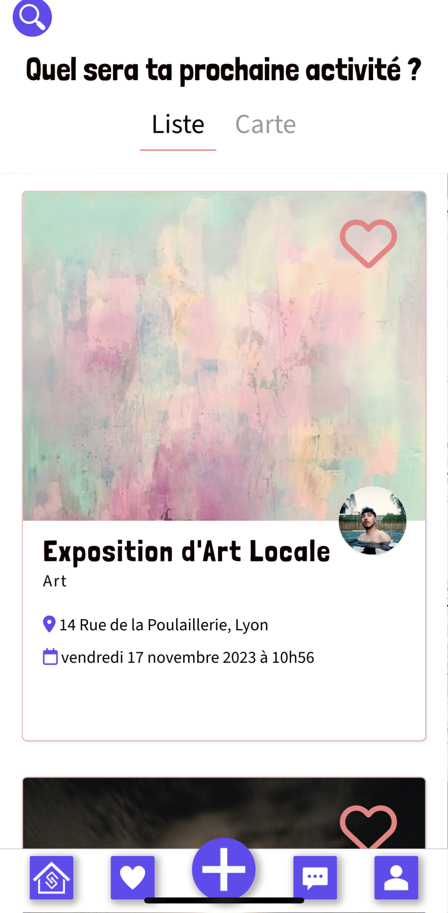
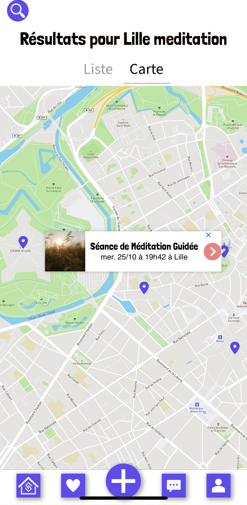
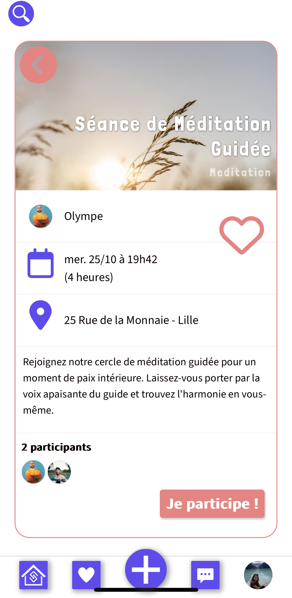
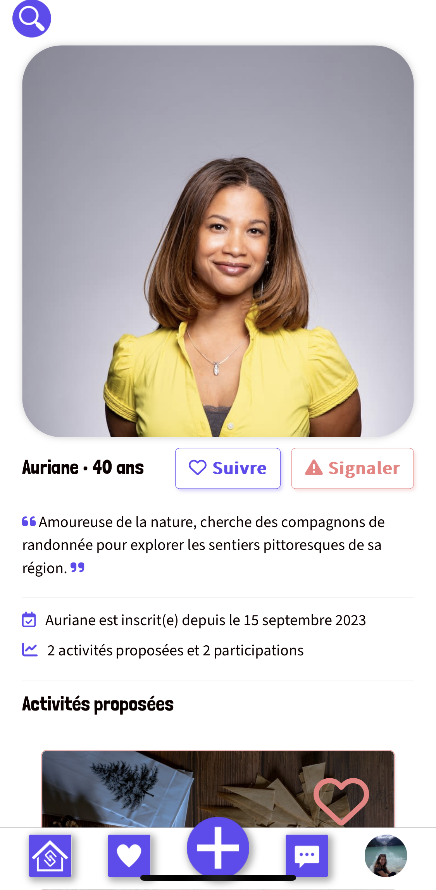
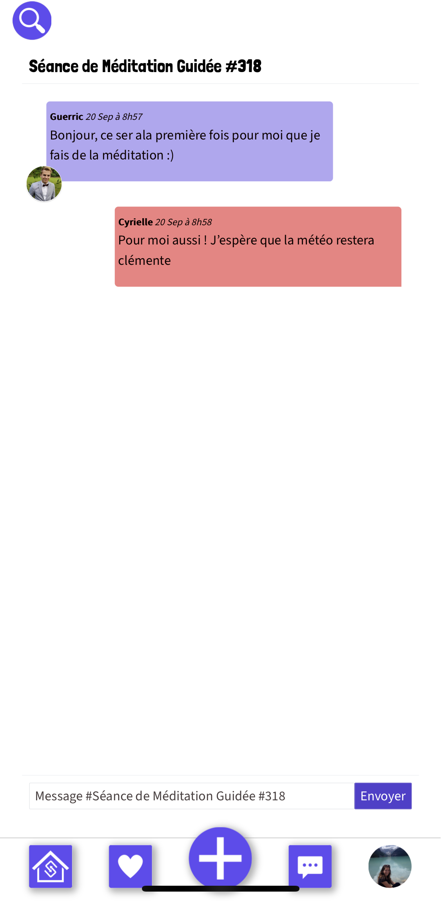
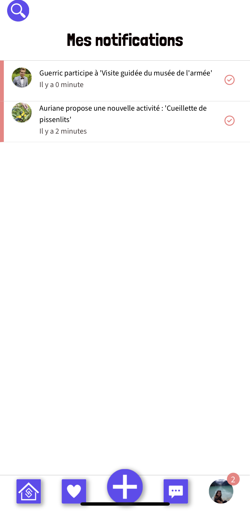

# Social Pulse

Découvrez des activités locales passionnantes avec Social Pulse. Inscrivez-vous et rejoignez la communauté dès maintenant !

Social Pulse est une application web (mobile-first) codée avec Ruby on Rails en deux semaines en tant que projet final du bootcamp du Wagon.

## Demo

https://www.youtube.com/watch?v=LTiW_5ZvUMw

## Authors

- [@GuerricSa](https://github.com/GuerricSa)
- [@Cyrielleiryc](https://github.com/Cyrielleiryc)
- [@KilianLeD](https://github.com/KilianLeD)

## Features

- Recherche par mot-clé et localisation
- Carte interactive
- Messagerie instantanée
- Notifications
- Réservation d'activités avec calendrier
- Favoris (activités et utilisateurs)

## Screenshots

